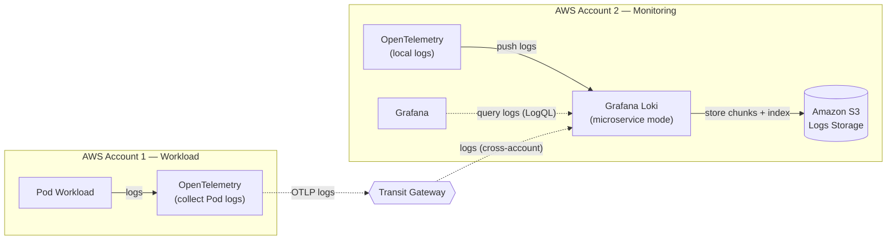
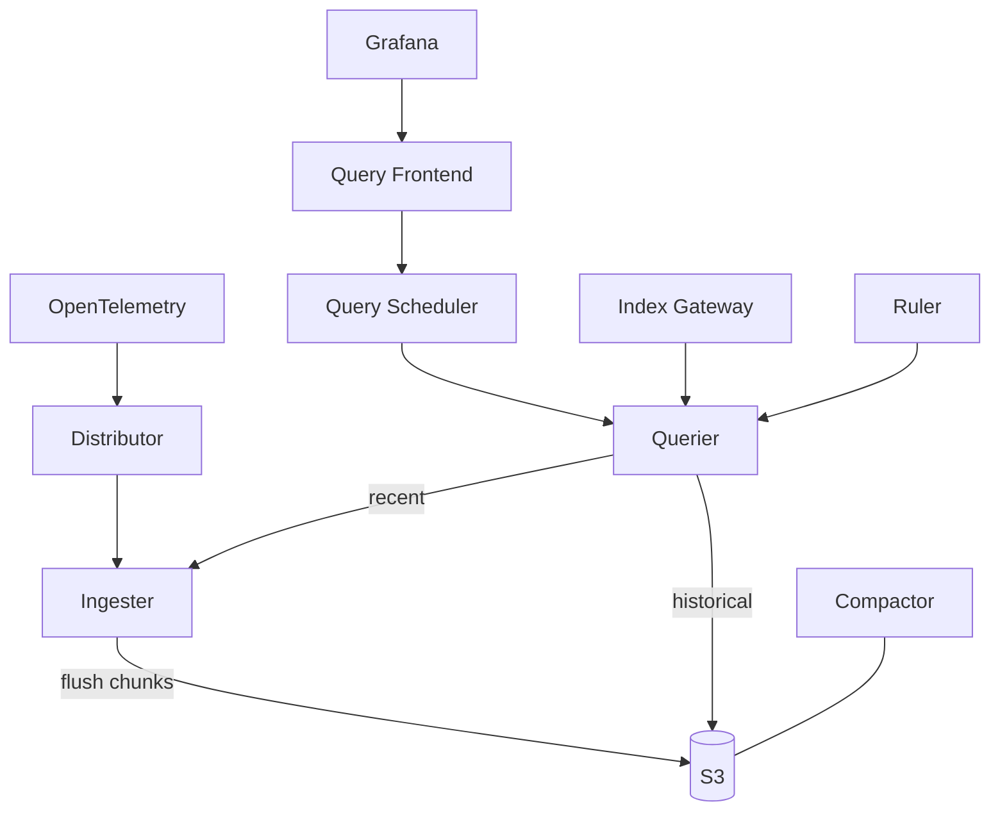

# Grafana Loki — Components

Loki runs in **microservice mode** inside the centralized monitoring account (AWS Account 2). It receives logs from workload accounts over the Transit Gateway, persists them to Amazon S3, and serves queries to Grafana.

Source diagram: [`monitoring-architecture.drawio`](./monitoring-architecture.drawio)

## Where Loki sits in the architecture

**Data flow:** OpenTelemetry collectors (in both accounts) push logs to Loki → Loki writes chunks and index to S3 → Grafana queries Loki via LogQL. Cross-account log traffic is routed through the Transit Gateway.

## Microservice-mode components

Loki splits the read path, write path, and background jobs into independently scalable services.

### Write path

| Component | Responsibility |
|-----------|----------------|
| **Distributor** | Entry point for incoming log pushes (from OTel). Validates, applies rate limits / tenant labels, then shards and fans out streams to ingesters via hashing. |
| **Ingester** | Buffers log streams in memory, builds chunks, and flushes them to S3 object storage. Also serves recent (not-yet-flushed) data to queriers. |

### Read path

| Component | Responsibility |
|-----------|----------------|
| **Query Frontend** | Front door for queries from Grafana. Splits large queries, queues them, and caches results. |
| **Query Scheduler** | Holds the queue of split sub-queries and hands them to queriers (decouples queueing from the frontend for scale). |
| **Querier** | Executes LogQL. Fetches recent data from ingesters and historical data from S3 (via the index gateway), then merges results. |
| **Index Gateway** | Serves the log index to queriers so they can locate chunks in S3 without each querier downloading the full index. |

### Background / storage

| Component | Responsibility |
|-----------|----------------|
| **Compactor** | Compacts and dedupes index files in S3; enforces retention and processes deletes. |
| **Ruler** | Evaluates recording / alerting rules over logs and can emit alerts. |
| **Amazon S3** | Object store backing both log **chunks** and the **index** (single durable backend). |

## Query path vs. write path (summary)

## Notes

- **Why microservice mode:** read and write paths scale independently — heavy log ingestion does not starve query capacity, and vice versa.
- **Single storage backend:** S3 holds both chunks and index, simplifying ops vs. legacy chunk+index split backends.
- **Cross-account:** workload-account logs reach this Loki only via the Transit Gateway; no direct VPC peering to the monitoring account.
